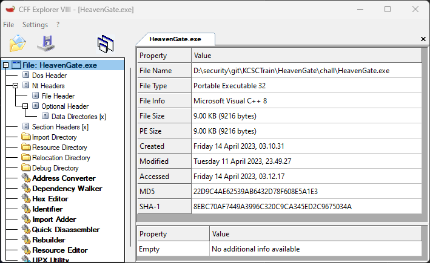
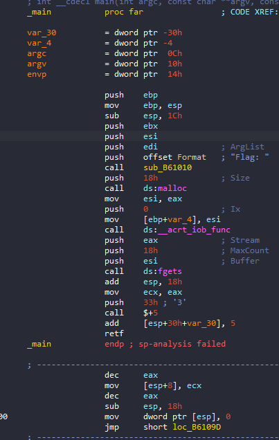
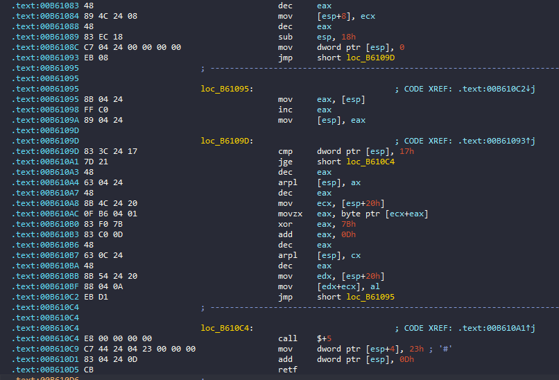
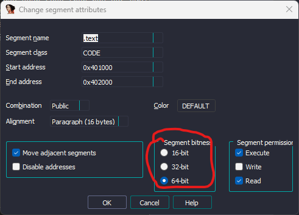
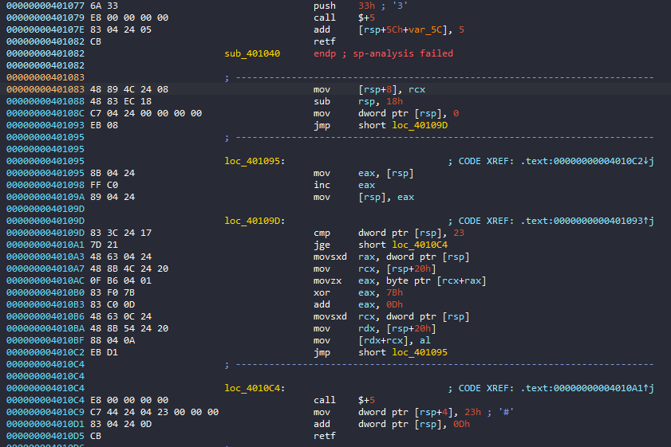
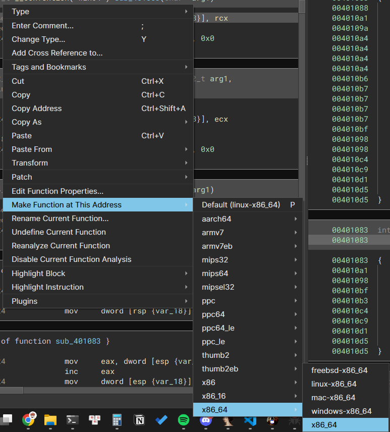
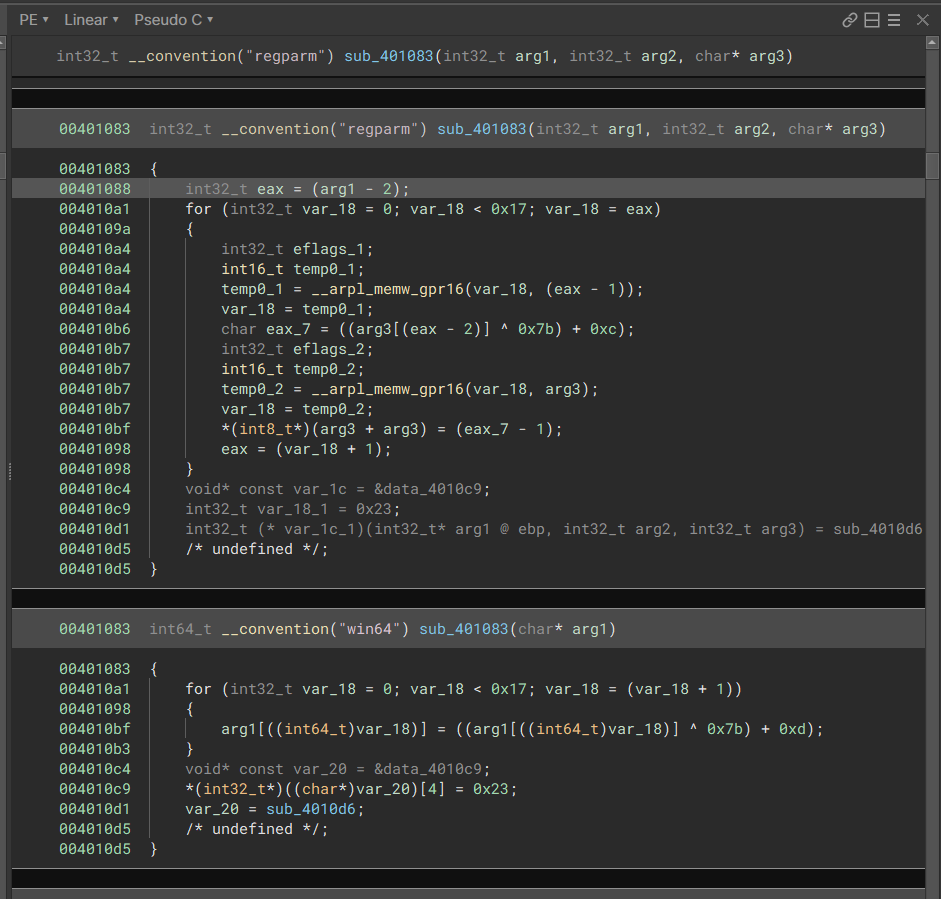

# HeavenGate

## CFF Explorer

File PE32



## IDA

Load file vào ida và bắt đầu từ hàm main



Đầu tiên chương trình yêu cầu chúng ta nhập flag với max là 24(18h) kí tự. Sau đó có một đoạn rất lạ, và IDA cũng không xử lý được: 


Sau khi google và đọc qua những bài [này](https://sachiel-archangel.medium.com/analysis-of-heavens-gate-part-1-62cca0ace6f0), [này](https://www.malwarebytes.com/blog/news/2018/01/a-coin-miner-with-a-heavens-gate) và [này](https://blog.vincss.net/2020/06/re015-heavens-gate-mot-ki-thuat-cu-nhung-hieu-qua.html). Thì mình biết được ở đây đang dùng một kĩ thuật được gọi là `Heaven Gate`. Kĩ thuật binary 32-bit thực thi các lệnh 64-bit. `0x33` là kí hiệu cho x64.Đầu tiên chương trình sẽ `push` lên stack `code segment` sau đó `call $+5` để `push` địa chỉ ngay sau lệnh call lên stack(ở đây là `0xB6107E`), sau đó cộng thêm 5 để lấy địa chỉ của phần lệnh muốn thực thi 64 bit(`0xB61083`),cuối cùng là lệnh `retf`(`ret far`) lệnh ngoài việc pop địa chỉ trả về thì còn pop `code segment`, vậy địa chỉ trả về thực tế là `0x33:0xB61083` nghĩa là từ địa chỉ `0xB61083` chương trình sẽ thực thi dưới dạng 64 bit:



Nhưng vì Opcode của 64-bit và 32-bit là khác nhau, vì vậy đoạn code trên nếu đọc dưới 32-bit thì sẽ sai, cho nên chúng ta phải chuyển sang 64-bit để đọc. Muốn chuyển được đầu tiên chúng ta load chương trình vào `IDA64`, Chọn `View`->`Open subviews`->`Segment`. Chọn segment mà đoạn code chúng ta muốn chuyển ở trong đó. Ở đây thì sẽ là `.text`. Tiếp theo, chuột phải chọn `Edit segment`, chọn sang chế độ 64 bit:



Thì ta được :



Cũng có một cách khác là sử dụng `Binary Ninja`. Chúng ta tìm đến đoạn code cần đổi sang 64 bit, Chuột Phải chọn `Make Function at This Address`->`x86_64`->`x86_x64`



Sau đó `Binary Ninja` sẽ cho chúng ta hàm đó ở cả 2 dạng là 32 bit và 64 bit: 



Từ đó chúng ta có thể thấy được chương trình mã hoá flag của chúng ta bằng cách lấy từng kí tự `xor` với `0x7b` sau đó cộng với `0xd`. Sau đó chương trình lại chuyển lại về 32 bit: 


Sau đó chương trình sẽ check flag bằng cách so sánh flag của chúng ta sau khi được mã hoá với một đoạn cipher đã có sẵn. Nếu giống thì in ra `Accepted`, ngược lại in ra `Wrong!`:


## script

```python
cipher = [ 0x2a, 0x24, 0x27, 0x29, 0x0d, 0x20, 0x2b, 0x27, 0x1a, 0x2b,
        0x22, 0x31, 0x29, 0x27, 0x1c, 0x2b, 0x31, 0x23, 0x27, 0x29,
        0x1f, 0x25, 0x13]

for i in range(len(cipher)):
    print(chr((cipher[i]-0xd)^0x7b),end="")
```

## flag
`flag{heaven_gate_magic}`
